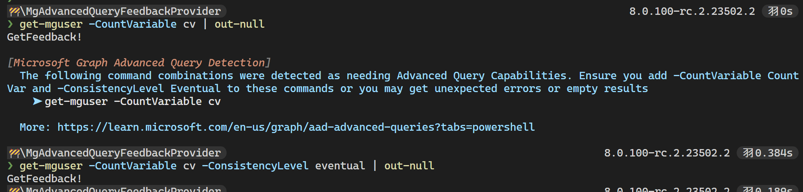

# PowerShell Feedback Provider for Microsoft Graph Advanced Queries

This feedback provider detects situations where you might get unusual results or cryptic error messages because you didn't add the proper parameters.

## Currently Implemented Detectors

https://learn.microsoft.com/en-us/graph/aad-advanced-queries?tabs=http#query-scenarios-that-require-advanced-query-capabilities

| Description | Implemented |
| ----------- | ----------- |
| Use of `$count` as a URL segment| Not used in Graph Commands |
| Use of `$count` as a query string parameter | ✅ |
| Use of `$count` as a filter expression | ✅ |
| Use of `$search` | ✅ |
| Use of `$filter` with the `endsWith` operator | ✅ |
| Use of `$filter` and `orderBy` in the same query | ✅ |
